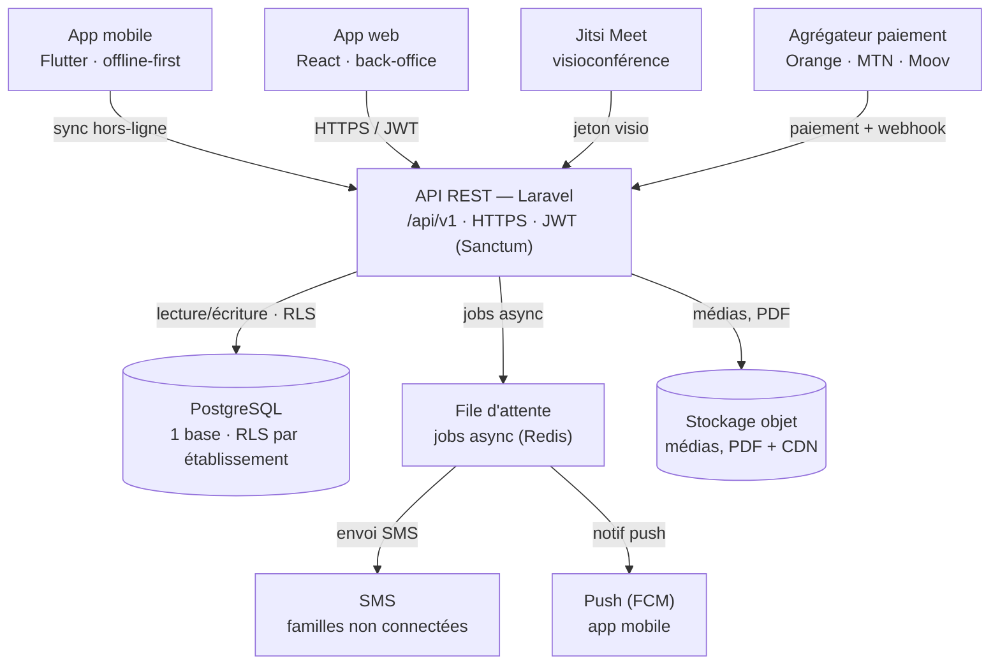
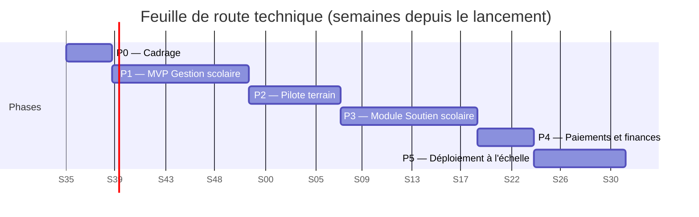

# Architecture technique de la plateforme scolaire

**Document** : ARCH-TECH-01
**Réfère à** : [`cahier-des-charges.md`](./cahier-des-charges.md), section 7
**Version** : 1.0 — Draft
**Date** : 29 août 2026
**Statut** : à valider en Phase 0
**Destinataires** : équipe technique, direction de projet

Formalise et prolonge la section 7 (« Architecture technique proposée ») du cahier des charges. Fixe les choix de stack, l'architecture système, la stratégie hors-ligne et la feuille de route technique servant de référence à l'équipe de développement à partir de la Phase 0.

---

## Sommaire

00. [Objet du document](#00--objet-du-document)
01. [Vue d'ensemble](#01--vue-densemble)
02. [Stack technique](#02--stack-technique)
03. [Données & multi-tenant](#03--données--multi-tenant)
04. [Stratégie hors-ligne](#04--stratégie-hors-ligne)
05. [Intégrations tierces](#05--intégrations-tierces)
06. [Sécurité](#06--sécurité)
07. [Infrastructure & CI/CD](#07--infrastructure--cicd)
08. [Feuille de route](#08--feuille-de-route)
09. [Équipe](#09--équipe)
10. [Risques techniques](#10--risques-techniques)
11. [Glossaire](#11--glossaire)

---

## 00 — Objet du document

Ce document s'adresse à l'équipe technique (backend, mobile, web, DevOps) ainsi qu'à la direction de projet pour validation avant le lancement du développement. Les choix présentés sont des propositions argumentées, pas des décisions figées — chaque section indique où un arbitrage reste ouvert.

---

## 01 — Vue d'ensemble

Un **monolithe modulaire** plutôt que des microservices : à l'échelle d'un projet qui démarre avec une équipe restreinte, la complexité opérationnelle des microservices coûterait plus qu'elle n'apporte. Le code est organisé en modules internes cloisonnés (Scolarité, Finances, Contenus, Notifications) pour pouvoir en extraire un service indépendant plus tard si la charge d'un domaine l'exige.

Les deux applications clientes (mobile et web) ne parlent qu'à une seule API REST versionnée. Elle isole les établissements en base de données, délègue les traitements asynchrones à une file d'attente, et s'appuie sur des services tiers pour la visioconférence et les paiements plutôt que de les reconstruire.

**Pourquoi un monolithe modulaire d'abord** : séparer trop tôt en microservices ajoute de la latence réseau interne, des déploiements coordonnés et une supervision distribuée — un coût que l'équipe cible (section 09) ne peut pas amortir en Phase 1. Le découpage en modules internes garde la porte ouverte à une extraction ultérieure, module par module, uniquement si la charge d'un domaine (par exemple le streaming vidéo du soutien scolaire) le justifie en Phase 5.

---

## 02 — Stack technique

Chaque choix est motivé par les contraintes propres au projet — connectivité faible, parc Android d'entrée de gamme, paiement mobile money — plutôt que par une préférence générique.

| Couche | Choix | Justification |
|---|---|---|
| Backend / API | Laravel (PHP) + Sanctum | Écosystème mature et main-d'œuvre disponible en Afrique francophone ; très productif pour du CRUD administratif ; packages PDF, export Excel et files d'attente prêts à l'emploi. |
| Base de données | PostgreSQL | Transactions fiables pour notes/finances ; Row-Level Security pour l'isolation multi-établissement ; JSONB pour les champs de paramétrage variables. |
| Application web | React (Vite) | SPA pour le back-office direction/administration ; pas besoin de SSR sur une interface entièrement authentifiée. |
| Application mobile | Flutter | Meilleures performances que React Native sur Android bas de gamme ; support hors-ligne natif (SQLite via `drift`) ; un seul codebase. |
| Visioconférence | Jitsi Meet auto-hébergé | Open source et gratuit ; repli audio-seul natif en bas débit ; SDK disponible pour Flutter et le web. |
| Paiements | Agrégateur mobile money | Une seule intégration pour Orange Money, MTN MoMo et Moov Money, plutôt que trois API distinctes à maintenir. |
| Notifications push | Firebase Cloud Messaging | Gratuit, standard sur Android — le parc majoritaire visé. |
| SMS | Passerelle SMS locale | Couverture réseau et tarification adaptées à la Guinée (à sourcer en Phase 0). |
| Stockage médias | Stockage objet (S3) + CDN | Diffusion des vidéos et bulletins PDF optimisée pour les zones à faible bande passante. |
| File d'attente | Jobs Laravel sur Redis | Traitement asynchrone des envois SMS/push et de la génération de documents, sans bloquer les requêtes API. |

> **Décision tranchée (29 août 2026)** : Laravel retenu. NestJS restait une alternative sérieuse si l'équipe recrutée s'avère majoritairement JavaScript ; à défaut de profils déjà connus à ce stade, la disponibilité de main-d'œuvre Laravel en Afrique francophone et la productivité sur du CRUD administratif l'emportent. Squelette backend amorcé dans `backend/`.

---

## 03 — Données & multi-tenant

Une base de données **unique** plutôt qu'une base par établissement : plus simple à opérer, à sauvegarder et à faire évoluer, et suffisante pour l'échelle visée (déploiement national progressif, pas des milliers de bases isolées).

Chaque table métier porte une colonne `etablissement_id`. L'isolation n'est pas seulement appliquée côté application : des politiques **Row-Level Security** PostgreSQL vérifient, au niveau de la base elle-même, qu'une requête ne peut lire ou écrire que les lignes de l'établissement courant — une défense en profondeur si un bug applicatif oubliait un filtre. Le contexte d'établissement est résolu à chaque requête authentifiée (sous-domaine ou sélection à la connexion pour un compte parent rattaché à plusieurs écoles) et posé comme variable de session avant chaque requête SQL.

### Entités principales

| Entité | Description | Portée |
|---|---|---|
| Établissement | Structure scolaire, cycle, paramétrage, année scolaire active | racine du tenant |
| Utilisateur | Compte, rôle, permissions (cf. cahier des charges §3) | établissement(s) |
| Classe / Inscription | Effectif, niveau, enseignant titulaire, historique de transferts | établissement |
| Note / Bulletin | Saisie par matière, calcul de moyennes, génération PDF, historique pluriannuel | élève |
| Présence | Appel quotidien, retard, absence, incident disciplinaire | classe / élève |
| Paiement | Échéancier, encaissement, reçu numérique, statut | élève / famille |
| Contenu pédagogique | Cours, vidéo, exercice, quiz — bibliothèque de soutien scolaire | global + suivi par élève |
| Séance | Classe virtuelle ou tutorat, présence enregistrée, enregistrement vidéo | classe / élève |
| Notification | Historique d'envoi push / SMS, statut de livraison | utilisateur |

---

## 04 — Stratégie hors-ligne

C'est la contrainte la plus structurante du cahier des charges (§6.1) : l'application mobile doit rester utilisable sans connexion, puis se resynchroniser proprement au retour du réseau.

1. Le mobile tient un miroir local en SQLite des données consultées (notes, emploi du temps, cours téléchargés) et des saisies en attente (présences, réponses aux quiz).
2. Chaque écriture hors-ligne se voit attribuer un identifiant unique généré côté client, pour que la resynchronisation reste sûre même en cas de retransmission.
3. Au retour du réseau, un lot d'écritures en attente est envoyé vers un point d'entrée de synchronisation, qui applique chaque écriture une seule fois même si elle est reçue plusieurs fois.
4. Le serveur reste la source de vérité pour les données sensibles (notes, paiements) ; le client affiche un état « en attente de synchronisation » tant que le serveur n'a pas confirmé.

> **Point de vigilance** : la complexité de ce mécanisme est régulièrement sous-estimée dans les plannings. Un prototype du cycle saisie hors-ligne → synchronisation, testé avec des coupures réseau simulées, doit être livré dès la Phase 0 — avant que le reste du module Gestion scolaire ne s'appuie dessus.

---

## 05 — Intégrations tierces

### Visioconférence — Jitsi Meet

Instance auto-hébergée plutôt qu'un SDK propriétaire facturé à la minute. L'API délivre un jeton de session à l'app cliente, qui rejoint la salle directement. Bascule automatique en audio-seul (ou audio + diapositives statiques) lorsque la bande passante détectée est insuffisante pour la vidéo, conformément au cahier des charges §4.8 et §6.1. Les enregistrements de séance sont transcodés puis déposés dans le stockage objet pour consultation différée.

### Paiements — agrégateur mobile money

L'API initie une demande de paiement auprès de l'agrégateur, qui gère la relation avec Orange Money, MTN MoMo et Moov Money. La confirmation arrive par webhook signé, réconciliée avec l'échéancier de l'élève ; un reçu numérique est généré à la confirmation, pas à l'initiation, pour éviter les faux positifs en cas de paiement abandonné.

### Notifications — FCM et SMS

Chaque appareil mobile enregistre un jeton FCM à la connexion ; les notifications ciblent un utilisateur, une classe ou un établissement entier (annonces générales, §4.7). La passerelle SMS ne sert qu'en complément — absences, retards, alertes de paiement — pour les familles sans smartphone ou sans connexion, avec suivi du statut de livraison et relance en cas d'échec.

---

## 06 — Sécurité

Le public concerné est en grande partie mineur : la sécurité n'est pas une case à cocher en fin de projet mais une exigence de conception, conforme au cahier des charges §6.3.

- **Contrôle d'accès par rôle** — matrice de permissions reprise du cahier des charges §3, appliquée côté API sur chaque route.
- **Isolation en base** — Row-Level Security PostgreSQL (section 03) comme filet de sécurité indépendant du code applicatif.
- **Chiffrement** — TLS de bout en bout ; chiffrement au repos des champs sensibles (identité, documents scannés) et des données de paiement.
- **Journal d'audit** — toute modification de note, de bulletin validé ou de paiement est tracée (auteur, horodatage, valeur avant/après), consultable par la direction.
- **Sauvegardes** — sauvegardes automatisées quotidiennes, restauration testée trimestriellement.
- **Accès production** — accès aux serveurs limité à l'équipe DevOps, pas d'accès SSH direct par défaut pour le reste de l'équipe.

---

## 07 — Infrastructure & CI/CD

Aucun data center mature n'étant disponible en Guinée à ce jour, l'hébergement démarre en Europe (type OVH ou Scaleway) avec un CDN en périphérie pour réduire la latence perçue et absorber une partie de la charge statique/médias — cohérent avec la priorité donnée au mode hors-ligne plutôt qu'à la latence réseau brute.

Phase 1-2 : un unique environnement conteneurisé (Docker Compose) derrière un reverse proxy, avec une base PostgreSQL managée et sauvegardée automatiquement — volontairement simple, une orchestration type Kubernetes serait prématurée à l'échelle de quelques établissements pilotes. La migration vers une infrastructure autoscalable n'intervient qu'en Phase 5, quand le nombre d'établissements le justifie réellement.

Intégration continue : tests et analyse statique à chaque pull request, déploiement automatique sur un environnement de recette, déploiement en production sur tag versionné avec validation manuelle.

---

## 08 — Feuille de route

Reprend le découpage en six phases du cahier des charges (§8), en y ajoutant les livrables techniques concrets de chaque étape.

*(P5 n'a pas de fin planifiée dans les faits — elle correspond à l'extension continue à d'autres établissements ; la barre ci-dessus est bornée arbitrairement pour l'affichage du diagramme.)*

| Phase | Semaines | Livrables techniques |
|---|---|---|
| P0 — Cadrage | S1–S4 | Schéma de base de données validé, contrat d'API (OpenAPI), environnements dev/staging + CI/CD, prototype de synchronisation hors-ligne, maquettes UX/UI validées. |
| P1 — MVP Gestion scolaire | S5–S16 | Auth/RBAC, modules établissements/classes/inscriptions/emploi du temps/notes/bulletins/présences, dashboard web direction, app mobile (consultation + saisie enseignant). |
| P2 — Pilote terrain | S17–S24 | Déploiement en production sur 2 à 5 établissements, import Excel/CSV en masse, supervision (erreurs, disponibilité), cycle de retours utilisateurs. |
| P3 — Soutien scolaire | S25–S36 | Bibliothèque de contenus, streaming vidéo compressé, moteur de quiz, réservation de tutorat, téléchargement hors-ligne des cours. |
| P4 — Paiements | S37–S41 | Intégration de l'agrégateur mobile money, échéanciers, reçus numériques, relances automatiques. |
| P5 — Déploiement à l'échelle | S42+ | Infrastructure autoscalable, onboarding self-service des nouveaux établissements, suivi du SLA de disponibilité (99 %). |

---

## 09 — Équipe

Dimensionnement cohérent avec le planning de la section 08, sans sureffectif en début de projet.

| Rôle | Disponibilité | Responsabilité principale |
|---|---|---|
| Tech lead / architecte | 1, temps plein | Arbitrages techniques, revue de code, cohérence de l'architecture |
| Développeur·se backend | 1–2, temps plein | API, modules métier, intégrations tierces |
| Développeur·se mobile | 1–2, temps plein | App Flutter, mode hors-ligne, synchronisation |
| Développeur·se web | 1, temps plein | Back-office direction/administration en React |
| Designer UX/UI | 1, intensif P0–P2 | Maquettes, tests utilisateurs en établissement pilote |
| QA | 1, dès P1 | Tests fonctionnels, non-régression, tests terrain |
| DevOps | 1, temps partiel | Infrastructure, CI/CD, supervision |

---

## 10 — Risques techniques

Complète les risques produit déjà identifiés au cahier des charges (§9) par des risques propres à l'exécution technique.

| Risque | Impact | Mesure d'atténuation |
|---|---|---|
| Complexité de la synchronisation hors-ligne sous-estimée | Retards en Phase 1, données dupliquées | Prototype dès la Phase 0, tests avec coupures réseau simulées |
| Dépendance à un unique agrégateur de paiement | Interruption des encaissements en cas de panne | Clause de SLA contractuelle, plan de bascule vers une intégration directe par opérateur |
| Latence réseau Guinée ↔ hébergement Europe | Temps de chargement dégradés | CDN en périphérie, priorité au mode hors-ligne pour les écrans critiques |
| Qualité vidéo incompatible avec la bande passante réelle | Abandon des cours vidéo en zone rurale | Transcodage adaptatif, résolution par défaut réduite, mode audio + diapositives |
| Accès non autorisé à des données d'élèves mineurs | Risque légal et réputationnel majeur | RLS en base, chiffrement au repos, journal d'audit, revue de sécurité avant la Phase 2 |

---

## 11 — Glossaire

- **RBAC** — contrôle d'accès basé sur les rôles : chaque utilisateur n'accède qu'aux actions permises par son rôle.
- **RLS (Row-Level Security)** — mécanisme PostgreSQL qui filtre les lignes accessibles directement au niveau de la base, par requête.
- **JWT** — jeton signé prouvant l'identité d'un utilisateur à chaque appel API, sans ressaisir de mot de passe.
- **API REST** — interface par laquelle les applications mobile et web échangent des données avec le serveur.
- **CDN** — réseau de serveurs répartis géographiquement qui rapproche les contenus (vidéos, fichiers) de l'utilisateur final.
- **Offline-first** — conception où l'application fonctionne d'abord avec les données locales, la synchronisation réseau étant secondaire.
- **Multi-tenant** — une même application et une même base de données servant plusieurs établissements de façon isolée.
- **Webhook** — notification automatique envoyée par un service tiers (ici l'agrégateur de paiement) vers l'API lors d'un évènement.
- **SLA** — engagement contractuel de niveau de service (ex. disponibilité de 99 %).
- **CI/CD** — intégration et déploiement continus : tests et mise en production automatisés à chaque changement de code.

---

*ARCH-TECH-01 · v1.0 draft · 29 août 2026 · à valider avec l'équipe technique en Phase 0*
