# Schéma de base de données — MVP Gestion scolaire

**Réfère à** : [`mvp-scope.md`](./mvp-scope.md), [`architecture-technique.md`](./architecture-technique.md) §03
**Moteur** : PostgreSQL
**Version** : 1.0
**Date** : 29 août 2026

Ce document détaille le schéma relationnel couvrant le périmètre défini dans `mvp-scope.md`. Les tables prévues pour les phases suivantes (soutien scolaire, classes virtuelles, mobile money, messagerie riche) ne sont pas incluses ici — elles feront l'objet d'une extension du schéma en Phase 3/4.

---

## 1. Principes de conception

- **Multi-tenant en base unique.** Chaque table scolaire porte une colonne `etablissement_id`. Une politique **Row-Level Security** PostgreSQL restreint chaque requête à l'établissement courant (voir §5) — en plus, pas à la place, du filtrage applicatif.
- **`utilisateurs` est une table globale, pas tenant-scopée.** Un parent peut être rattaché à des enfants dans des établissements différents (cahier des charges §3) ; c'est la table de jonction `etablissement_utilisateurs` qui porte le rôle et le rattachement, pas le compte lui-même.
- **Champs communs** à toutes les tables sauf mention contraire : `id bigint PRIMARY KEY GENERATED ALWAYS AS IDENTITY`, `created_at timestamptz DEFAULT now()`, `updated_at timestamptz DEFAULT now()`.
- **Synchronisation hors-ligne.** Les deux tables saisies par les enseignants en mobilité (`notes`, `presences`) portent un `sync_uuid` généré côté client et un `statut_sync`, conformément à la stratégie décrite dans `architecture-technique.md` §04.
- **Devises et notes** : `numeric`, jamais `float`, pour les montants et moyennes.

---

## 2. Diagramme entité-relation

```mermaid
erDiagram
    UTILISATEURS ||--o{ ETABLISSEMENT_UTILISATEURS : occupe
    ETABLISSEMENTS ||--o{ ETABLISSEMENT_UTILISATEURS : regroupe
    ETABLISSEMENTS ||--o{ ANNEES_SCOLAIRES : planifie
    ETABLISSEMENTS ||--o{ CLASSES : compte
    ANNEES_SCOLAIRES ||--o{ CLASSES : durant
    ETABLISSEMENTS ||--o{ MATIERES : definit
    CLASSES ||--o{ CLASSE_MATIERE_ENSEIGNANT : programme
    MATIERES ||--o{ CLASSE_MATIERE_ENSEIGNANT : enseignee_dans
    UTILISATEURS ||--o{ CLASSE_MATIERE_ENSEIGNANT : enseigne
    ETABLISSEMENTS ||--o{ ELEVES : scolarise
    ELEVES ||--o{ INSCRIPTIONS : a
    CLASSES ||--o{ INSCRIPTIONS : accueille
    ANNEES_SCOLAIRES ||--o{ INSCRIPTIONS : pour
    UTILISATEURS ||--o{ PARENT_ELEVE : est_parent_de
    ELEVES ||--o{ PARENT_ELEVE : a_pour_parent
    CLASSES ||--o{ EMPLOIS_DU_TEMPS : planifie
    MATIERES ||--o{ EMPLOIS_DU_TEMPS : porte_sur
    UTILISATEURS ||--o{ EMPLOIS_DU_TEMPS : anime
    ANNEES_SCOLAIRES ||--o{ PERIODES_EVALUATION : decoupe
    CLASSE_MATIERE_ENSEIGNANT ||--o{ EVALUATIONS : programme
    PERIODES_EVALUATION ||--o{ EVALUATIONS : dans
    EVALUATIONS ||--o{ NOTES : genere
    ELEVES ||--o{ NOTES : recoit
    ELEVES ||--o{ BULLETINS : a
    PERIODES_EVALUATION ||--o{ BULLETINS : cloture
    ELEVES ||--o{ PRESENCES : a
    CLASSES ||--o{ PRESENCES : enregistre
    ETABLISSEMENTS ||--o{ FRAIS_SCOLARITE : fixe
    FRAIS_SCOLARITE ||--o{ ECHEANCES : detaille
    ELEVES ||--o{ ECHEANCES : doit
    ECHEANCES ||--o{ PAIEMENTS : regle
    ETABLISSEMENTS ||--o{ ANNONCES : publie
    UTILISATEURS ||--o{ ANNONCES : redige
    UTILISATEURS ||--o{ NOTIFICATIONS : recoit

    UTILISATEURS {
        bigint id PK
        varchar telephone
        varchar role_global
    }
    ETABLISSEMENTS {
        bigint id PK
        varchar nom
        varchar cycle
    }
    ETABLISSEMENT_UTILISATEURS {
        bigint id PK
        bigint etablissement_id FK
        bigint utilisateur_id FK
        varchar role
    }
    ANNEES_SCOLAIRES {
        bigint id PK
        bigint etablissement_id FK
        varchar libelle
        boolean est_active
    }
    CLASSES {
        bigint id PK
        bigint etablissement_id FK
        bigint annee_scolaire_id FK
        varchar niveau
    }
    MATIERES {
        bigint id PK
        bigint etablissement_id FK
        varchar nom
    }
    CLASSE_MATIERE_ENSEIGNANT {
        bigint id PK
        bigint classe_id FK
        bigint matiere_id FK
        bigint enseignant_id FK
    }
    ELEVES {
        bigint id PK
        bigint etablissement_id FK
        varchar matricule
        varchar nom
    }
    INSCRIPTIONS {
        bigint id PK
        bigint eleve_id FK
        bigint classe_id FK
        bigint annee_scolaire_id FK
    }
    PARENT_ELEVE {
        bigint id PK
        bigint utilisateur_id FK
        bigint eleve_id FK
        varchar lien
    }
    EMPLOIS_DU_TEMPS {
        bigint id PK
        bigint classe_id FK
        bigint matiere_id FK
        bigint enseignant_id FK
    }
    PERIODES_EVALUATION {
        bigint id PK
        bigint etablissement_id FK
        bigint annee_scolaire_id FK
        varchar libelle
    }
    EVALUATIONS {
        bigint id PK
        bigint classe_matiere_enseignant_id FK
        bigint periode_id FK
        varchar type
    }
    NOTES {
        bigint id PK
        bigint evaluation_id FK
        bigint eleve_id FK
        numeric valeur
        uuid sync_uuid
    }
    BULLETINS {
        bigint id PK
        bigint eleve_id FK
        bigint periode_id FK
        numeric moyenne_generale
    }
    PRESENCES {
        bigint id PK
        bigint eleve_id FK
        bigint classe_id FK
        date date
        varchar statut
        uuid sync_uuid
    }
    FRAIS_SCOLARITE {
        bigint id PK
        bigint etablissement_id FK
        varchar niveau
        numeric montant_total
    }
    ECHEANCES {
        bigint id PK
        bigint frais_scolarite_id FK
        bigint eleve_id FK
        numeric montant_du
        varchar statut
    }
    PAIEMENTS {
        bigint id PK
        bigint echeance_id FK
        numeric montant
        varchar mode
    }
    ANNONCES {
        bigint id PK
        bigint etablissement_id FK
        bigint auteur_id FK
        varchar titre
    }
    NOTIFICATIONS {
        bigint id PK
        bigint utilisateur_id FK
        varchar canal
        varchar statut_envoi
    }
```



---

## 3. Détail des tables

### 3.1 Identité et établissements

**`utilisateurs`** — table globale, non tenant-scopée
| Colonne | Type | Contraintes |
|---|---|---|
| id | bigint | PK |
| nom, prenom | varchar(100) | NOT NULL |
| telephone | varchar(20) | UNIQUE NOT NULL — canal SMS et identifiant de connexion principal |
| email | varchar(255) | UNIQUE, nullable |
| mot_de_passe_hash | varchar(255) | NOT NULL |
| langue_preferee | varchar(10) | DEFAULT 'fr' |
| est_super_admin | boolean | DEFAULT false |
| statut | varchar(20) | `actif` \| `suspendu` |

**`etablissements`**
| Colonne | Type | Contraintes |
|---|---|---|
| id | bigint | PK |
| nom | varchar(255) | NOT NULL |
| cycle | varchar(20) | `primaire` \| `college` \| `lycee` \| `mixte` |
| adresse, ville, region | varchar(255) | |
| logo_url | text | nullable |
| statut | varchar(20) | `actif` \| `inactif` |

**`etablissement_utilisateurs`** — rattachement + rôle (RBAC)
| Colonne | Type | Contraintes |
|---|---|---|
| id | bigint | PK |
| etablissement_id | bigint | FK → etablissements |
| utilisateur_id | bigint | FK → utilisateurs |
| role | varchar(30) | `admin_etablissement` \| `enseignant` \| `personnel_administratif` \| `parent` |
| statut | varchar(20) | `actif` \| `invite` \| `suspendu` |
| — | | UNIQUE (etablissement_id, utilisateur_id, role) |

**`annees_scolaires`**
| Colonne | Type | Contraintes |
|---|---|---|
| id | bigint | PK |
| etablissement_id | bigint | FK |
| libelle | varchar(20) | ex. `2026-2027` |
| date_debut, date_fin | date | NOT NULL |
| est_active | boolean | un seul `true` par établissement (contrainte applicative) |

### 3.2 Scolarité

**`classes`**
| Colonne | Type | Contraintes |
|---|---|---|
| id | bigint | PK |
| etablissement_id | bigint | FK |
| annee_scolaire_id | bigint | FK |
| niveau | varchar(30) | ex. `CM2`, `7e`, `Terminale S` |
| libelle | varchar(50) | ex. `CM2 A` |
| enseignant_titulaire_id | bigint | FK → utilisateurs, nullable |
| effectif_max | int | |

**`matieres`**
| Colonne | Type | Contraintes |
|---|---|---|
| id | bigint | PK |
| etablissement_id | bigint | FK |
| nom | varchar(100) | NOT NULL |
| coefficient_defaut | numeric(3,1) | DEFAULT 1 |

**`classe_matiere_enseignant`** — affectation
| Colonne | Type | Contraintes |
|---|---|---|
| id | bigint | PK |
| classe_id | bigint | FK |
| matiere_id | bigint | FK |
| enseignant_id | bigint | FK → utilisateurs |
| coefficient | numeric(3,1) | surcharge `matieres.coefficient_defaut` si renseigné |
| — | | UNIQUE (classe_id, matiere_id) |

**`eleves`**
| Colonne | Type | Contraintes |
|---|---|---|
| id | bigint | PK |
| etablissement_id | bigint | FK |
| matricule | varchar(30) | UNIQUE (etablissement_id, matricule) |
| nom, prenom | varchar(100) | NOT NULL |
| date_naissance | date | |
| sexe | varchar(1) | `M` \| `F` |
| photo_url | text | nullable |
| statut | varchar(20) | `actif` \| `inactif` \| `diplome` |

**`inscriptions`**
| Colonne | Type | Contraintes |
|---|---|---|
| id | bigint | PK |
| eleve_id | bigint | FK |
| classe_id | bigint | FK |
| annee_scolaire_id | bigint | FK |
| date_inscription | date | NOT NULL |
| statut | varchar(20) | `inscrit` \| `abandonne` |
| — | | UNIQUE (eleve_id, annee_scolaire_id) |

**`parent_eleve`** — liaison many-to-many, traverse les établissements
| Colonne | Type | Contraintes |
|---|---|---|
| id | bigint | PK |
| utilisateur_id | bigint | FK → utilisateurs (rôle parent) |
| eleve_id | bigint | FK → eleves |
| lien | varchar(20) | `pere` \| `mere` \| `tuteur_legal` \| `autre` |
| est_contact_principal | boolean | DEFAULT false |

**`emplois_du_temps`**
| Colonne | Type | Contraintes |
|---|---|---|
| id | bigint | PK |
| classe_id | bigint | FK |
| matiere_id | bigint | FK |
| enseignant_id | bigint | FK → utilisateurs |
| jour_semaine | smallint | 1 (lundi) à 7 |
| heure_debut, heure_fin | time | NOT NULL |
| salle | varchar(50) | nullable |

### 3.3 Évaluations

**`periodes_evaluation`**
| Colonne | Type | Contraintes |
|---|---|---|
| id | bigint | PK |
| etablissement_id | bigint | FK |
| annee_scolaire_id | bigint | FK |
| libelle | varchar(30) | ex. `Trimestre 1` |
| date_debut, date_fin | date | |
| statut | varchar(20) | `en_cours` \| `cloturee` |

**`evaluations`**
| Colonne | Type | Contraintes |
|---|---|---|
| id | bigint | PK |
| classe_matiere_enseignant_id | bigint | FK |
| periode_id | bigint | FK |
| type | varchar(20) | `devoir` \| `composition` \| `interrogation` |
| libelle | varchar(100) | |
| coefficient | numeric(3,1) | |
| date_evaluation | date | |

**`notes`**
| Colonne | Type | Contraintes |
|---|---|---|
| id | bigint | PK |
| evaluation_id | bigint | FK |
| eleve_id | bigint | FK |
| valeur | numeric(4,2) | nullable (élève absent à l'évaluation) |
| appreciation | text | nullable |
| saisie_par | bigint | FK → utilisateurs |
| sync_uuid | uuid | UNIQUE — identifiant généré côté client mobile |
| statut_sync | varchar(20) | `synced` \| `pending` |
| — | | UNIQUE (evaluation_id, eleve_id) |

**`bulletins`**
| Colonne | Type | Contraintes |
|---|---|---|
| id | bigint | PK |
| eleve_id | bigint | FK |
| periode_id | bigint | FK |
| moyenne_generale | numeric(4,2) | |
| rang | int | |
| effectif_classe | int | |
| appreciation_generale | text | nullable |
| pdf_url | text | |
| statut | varchar(20) | `brouillon` \| `valide` \| `publie` |
| valide_par | bigint | FK → utilisateurs, nullable |
| — | | UNIQUE (eleve_id, periode_id) |

### 3.4 Présences

**`presences`**
| Colonne | Type | Contraintes |
|---|---|---|
| id | bigint | PK |
| eleve_id | bigint | FK |
| classe_id | bigint | FK |
| date | date | NOT NULL |
| statut | varchar(20) | `present` \| `absent` \| `retard` \| `excuse` |
| saisie_par | bigint | FK → utilisateurs |
| sync_uuid | uuid | UNIQUE |
| statut_sync | varchar(20) | `synced` \| `pending` |
| — | | UNIQUE (eleve_id, classe_id, date) |

### 3.5 Finances (encaissement manuel — MVP)

**`frais_scolarite`** — barème
| Colonne | Type | Contraintes |
|---|---|---|
| id | bigint | PK |
| etablissement_id | bigint | FK |
| annee_scolaire_id | bigint | FK |
| niveau | varchar(30) | |
| montant_total | numeric(10,2) | |

**`echeances`**
| Colonne | Type | Contraintes |
|---|---|---|
| id | bigint | PK |
| frais_scolarite_id | bigint | FK |
| eleve_id | bigint | FK |
| libelle | varchar(50) | ex. `1ère tranche` |
| montant_du | numeric(10,2) | |
| date_echeance | date | |
| statut | varchar(20) | `paye` \| `partiel` \| `impaye` |

**`paiements`**
| Colonne | Type | Contraintes |
|---|---|---|
| id | bigint | PK |
| echeance_id | bigint | FK |
| montant | numeric(10,2) | |
| mode | varchar(20) | `especes` \| `cheque` — `mobile_money` réservé pour la Phase 4 |
| reference_recu | varchar(50) | UNIQUE |
| encaisse_par | bigint | FK → utilisateurs |
| date_paiement | date | |
| pdf_recu_url | text | |

### 3.6 Communication

**`annonces`**
| Colonne | Type | Contraintes |
|---|---|---|
| id | bigint | PK |
| etablissement_id | bigint | FK |
| auteur_id | bigint | FK → utilisateurs |
| titre | varchar(150) | |
| contenu | text | |
| cible_type | varchar(20) | `etablissement` \| `classe` |
| cible_id | bigint | nullable |
| publiee_le | timestamptz | |

**`notifications`** — journal d'envoi
| Colonne | Type | Contraintes |
|---|---|---|
| id | bigint | PK |
| utilisateur_id | bigint | FK, nullable si envoi SMS à un numéro sans compte |
| canal | varchar(10) | `push` \| `sms` |
| type | varchar(20) | `absence` \| `annonce` \| `paiement` |
| contenu | text | |
| statut_envoi | varchar(20) | `envoye` \| `echoue` \| `en_attente` |
| type_objet, reference_objet | varchar(30), bigint | ex. `presence`, 4821 |
| envoye_le | timestamptz | |

---

## 4. Index recommandés

- Toutes les colonnes `etablissement_id` — support des politiques RLS et des requêtes filtrées par tenant.
- `notes(sync_uuid)`, `presences(sync_uuid)` — idempotence de la synchronisation hors-ligne.
- `utilisateurs(telephone)` — recherche à la connexion.
- `eleves(etablissement_id, matricule)` — recherche administrative fréquente.
- `paiements(echeance_id)`, `echeances(eleve_id)` — tableau de bord financier.

---

## 5. Isolation multi-tenant (RLS)

> Ce schéma a été implémenté en migrations SQL réelles et exécuté contre PostgreSQL 16 pour vérifier l'isolation (pas seulement documentée) — voir [`db/`](../db/). Deux points ci-dessous ont été corrigés par rapport à une première version de ce document, à l'usage.

Toutes les tables ne portent pas `etablissement_id` directement. Deux cas :

**Tables avec la colonne directe** (`etablissements`, `etablissement_utilisateurs`, `annees_scolaires`, `classes`, `matieres`, `eleves`, `periodes_evaluation`, `frais_scolarite`, `annonces`) — policy simple :

```sql
ALTER TABLE eleves ENABLE ROW LEVEL SECURITY;

CREATE POLICY tenant_isolation ON eleves
  USING (etablissement_id = current_etablissement_id());
```

**Tables sans la colonne**, scopées via la table parente qui la porte (`classe_matiere_enseignant`, `inscriptions`, `emplois_du_temps`, `evaluations`, `notes`, `bulletins`, `presences`, `echeances`, `paiements`) — policy par `EXISTS`, y compris sur deux niveaux de jointure pour `paiements` :

```sql
ALTER TABLE paiements ENABLE ROW LEVEL SECURITY;

CREATE POLICY tenant_isolation ON paiements
  USING (EXISTS (
    SELECT 1 FROM echeances ec
    JOIN eleves e ON e.id = ec.eleve_id
    WHERE ec.id = paiements.echeance_id
      AND e.etablissement_id = current_etablissement_id()
  ));
```

L'API pose `SET app.current_etablissement_id = '<id>'` au début de chaque transaction, une fois le token JWT vérifié et l'établissement résolu. Sans cette variable posée, les tables scopées renvoient 0 ligne (échec fermé silencieux, pas d'erreur) — l'API doit donc la poser systématiquement, jamais l'omettre par erreur sur un chemin de code.

`utilisateurs` (globale), `parent_eleve` et `notifications` n'ont volontairement **pas** de policy par établissement : un parent est lié à des enfants de plusieurs établissements et une boîte de notifications lui appartient, pas à une école. Leur accès est filtré en application, pas en RLS — voir le détail dans [`db/migrations/022_rls_policies.sql`](../db/migrations/022_rls_policies.sql).

### ⚠️ Piège vérifié : le rôle propriétaire échappe à ses propres policies

Postgres exempte par défaut le **propriétaire** d'une table de ses propres politiques RLS. En testant avec le rôle ayant fait tourner les migrations, la RLS ne filtrait **rien du tout** — silencieusement, sans erreur. La correction : l'API doit se connecter avec un rôle applicatif dédié, distinct du propriétaire et non superuser (`db/setup_app_role.sql`). Vérifié après correction : le même jeu de données est correctement filtré par établissement.

### Deux policies permissives supplémentaires (023, 024), trouvées en câblant le backend

Vérifier manuellement en `psql` (comme ci-dessus) ne suffit pas : deux bugs ne sont apparus qu'en interrogeant les tables *via l'application*, dans l'ordre réel des requêtes. Postgres combine les policies RLS **permissives** en OR (pas en AND), ce qui permet de les ajouter sans toucher à `tenant_isolation` :

- **`023_super_admin_rls_bypass.sql`** — `GET /etablissements` (liste globale, super-admin) n'a par construction aucun établissement dans son URL, donc pas de `app.current_etablissement_id` possible. Policy permissive : une ligne de `etablissements` passe aussi si `app.is_super_admin = 'true'`, posé par l'application après vérification du rôle.
- **`024_own_rattachement_rls_bypass.sql`** — pour décider si l'utilisateur a accès à l'établissement demandé, l'API lit `etablissement_utilisateurs` — qui exige, elle aussi, `app.current_etablissement_id`. Sauf que c'est précisément cette variable qu'on est en train de déterminer : sans correctif, la vérification se bloque elle-même et renvoie 0 ligne même pour l'utilisateur légitime. Policy permissive : un utilisateur voit toujours **ses propres** lignes de rattachement (`utilisateur_id = app.current_utilisateur_id`), quel que soit le contexte tenant déjà fixé ou non.

Voir [`backend/app/Http/Middleware/ResolveEtablissementContext.php`](../backend/app/Http/Middleware/ResolveEtablissementContext.php) pour l'ordre exact dans lequel les trois variables de session (`app.current_utilisateur_id`, `app.is_super_admin`, `app.current_etablissement_id`) sont posées — cet ordre n'est pas arbitraire, l'inverser réintroduit le bug 024.

---

## 6. Hors périmètre de ce schéma

Tables à concevoir lors des phases suivantes, volontairement absentes ici : `contenus_pedagogiques`, `quiz`, `seances_tutorat` (Phase 3 — Volet B) ; `seances_classe_virtuelle` (hors MVP, cf. `mvp-scope.md` §4.8) ; `incidents_disciplinaires`, `messages` (V1.1) ; extension de `paiements.mode` pour le mobile money (Phase 4).
